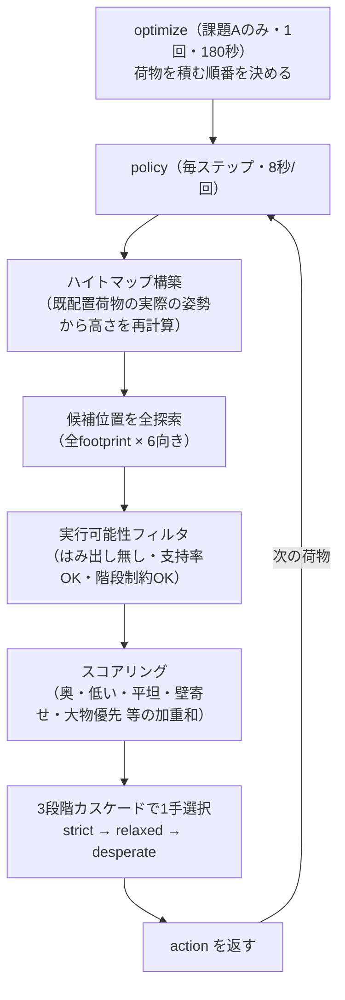

# NEDO Ground Handling パッキング問題と v52 アルゴリズム解説

最終更新: 2026-08-10 / 対象: リポジトリ既定値（v52、Public 63.16）

この資料は、(1) 何を解く問題なのか、(2) 現在の最良提出 v52 がどう解いているのか、を
コードを読まなくても分かるようにまとめたものです。詳細な実験過程・数値根拠は
`docs/findings_2026-07.md`、開発中の申し送りは `docs/HANDOFF.md` を参照してください。

---

## 1. 問題設定

### 1.1 何を解く問題か

**「手荷物を、横から荷物を出し入れするコンテナへ、なるべく多く・安定して・きれいに
詰め込む」問題です。** PyBullet という物理演算エンジンの上で動く環境（Gymnasium API 準拠）
に対して、荷物をどこに・どの向きで置くかを決める **エージェント**（`Agent` クラス）を
実装します。

- コンテナは横（Y軸マイナス側）に開口部があり、荷物はそこから水平にスライドさせて
  搬入するイメージです（現実のコンテナ荷役に近い制約）。
- 荷物は一列に並んだコンベアのように次々流れてきます。エージェントは毎回、
  「いま見えている数個（`look_ahead`個）の荷物のうち、どれを・どのコンテナの・
  どの座標に・どの向きで置くか」を選びます。
- 選んだ配置は実際に物理シミュレーションで実行されます（該当位置までスライド搬入 →
  静かに落として沈降）。**その結果ズレたり傾いたりすれば「配置失敗」としてやり直しは
  効きません。** 一度失敗するとエピソードがそこで打ち切られます。

### 1.2 エージェントが実装する3つのメソッド

| メソッド | 呼ばれるタイミング | 役割 |
|---|---|---|
| `get_init_states` | エピソード開始前・1回 | コンテナ形状などの初期情報を受け取る |
| `optimize` | （オフライン最適化が有効な課題のみ）評価直後・1回・**制限時間180秒** | 全荷物を見て「積み込む順番」だけを決める（配置そのものは決めない） |
| `policy` | 毎ステップ・**制限時間8秒/回** | 「今見えている荷物のうち、どれを・どのコンテナの・どの座標・どの向きに置くか」を1手ずつ決める |

`policy` が返す1手の形式:

```python
{
  'item_idx': 0,        # 見えている荷物プールの何番目か
  'container_idx': 0,   # どのコンテナか
  'place_pos': [x,y,z], # 置く場所の中心座標（相対座標）
  'orientation': 0,     # 6通りの向きのどれか
}
```

### 1.3 荷物の2つの特殊属性

| 属性 | 意味 | スコアへの影響 |
|---|---|---|
| `is_soft` | クッション性のある柔らかい荷物（例: ダッフルバッグ、段ボール、リュック） | 上に固い荷物を乗せると減点（下敷き）。物理的にも接触が柔らかく、上に荷物が乗ると沈み込む・傾きやすい |
| `is_prioritized` | ファーストクラスや乗継便の優先手荷物 | 一般荷物の下敷きになる／優先用コンテナがあるのに一般コンテナへ置く／**未積載**、のいずれも減点 |

### 1.4 配置1回ごとの検証（ここで失敗すると即座にエピソード終了）

荷物を置くたびに、公式コードが以下を順にチェックします。

1. **包含判定**: コンテナの内寸から荷物がはみ出していないか
2. **搬入経路判定**: 開口部から目標位置まで、他の荷物にぶつからずスライドできるか
   （持ち上げてから奥へ・横へ、の2軸移動で判定）
3. **配置安定性判定**: 静かに沈降させた後、目標位置から大きくズレたり傾いたりしていないか
   （ズレ0.3m超 または 傾き45°超で「崩れた」判定）

**この3つのどれか1つでも失敗すると、そのエピソードは即座に打ち切られます。** やり直しは
ありません。以降積むはずだった荷物はすべて「未積載」のまま評価されます。

### 1.5 評価指標（最終スコアの内訳）

| 指標 | 内容 |
|---|---|
| **fill_score**（充填率） | コンテナ有効体積に対して、完全に収まった荷物の体積の割合 |
| **cog_score**（重心） | 荷物全体の質量加重重心がどれだけ低い位置にあるか |
| **stability_score**（安定性） | コンテナを揺らした際に荷崩れしないか（動的テスト） |
| **placement_score**（配置適切性） | 優先荷物が適切な位置に置かれているか |
| **soft_item_score**（ソフト品配置） | ソフト品が適切な位置に置かれているか（下敷きになっていないか） |
| **num_placed_items**（積載率） | 全荷物のうち実際に積めた割合 |

これらの加重平均が最終スコア（Public Score）になります。**荷物を一定数以上積めていないと
fill_score 以外は0になる**ため、まず何個積めるか（積載率）が土台になります。

過去の提出データから逆算した参考値（`scripts/fit_public.py`、21件の提出から推定・
公式重みではない）は fill 0.369 / cog 0.264 / stability 0.177 / placement ≈0 / soft 0.191
です。**cog と stability はほぼ 1:1 で連動する**ことが分かっており（相関係数 0.98）、
実質的に「充填率」「積載率」「cog（≈stability）」「soft/placement」の3〜4軸勝負です。

### 1.6 2種類のタスク性格（課題A / 課題B）

このプロジェクトの検証では、実際の課題が大きく2つの性格に分かれることが分かっています。

| | 課題A | 課題B |
|---|---|---|
| `optimize`（オフライン最適化） | あり | なし |
| `look_ahead`（一度に見える荷物数） | 1個 | 複数個（例: 10個） |
| 主な戦略 | **順序**を事前に工夫できる（配置自体は貪欲法1個ずつ） | 順序の工夫が効かない代わりに、毎手で複数候補から選べる |

`optimize()` は課題Aでしか呼ばれないため、「荷物を置く順番を並べ替える」系の対策は
課題Bには一切効きません（`app.py` が `optimize=true` のときしか呼ばない設計）。

### 1.7 なぜ難しいのか

1. **後戻りできない**: 1回配置が失敗するとエピソード終了。安全策に倒すと積載数が減り、
   攻めると崩壊リスクが上がる、というトレードオフを毎手判断する必要がある。
2. **搬入経路の制約が強い**: 奥に荷物を置きすぎると、後から来る荷物のスライド経路を
   自分で塞いでしまう（詳しくは2.6節）。
3. **物理沈降で本当の位置がズレる**: 特にソフト品の上に荷物を置くと、着地後に沈み込み・
   傾きが発生する。ヒートマップ上の「置いたつもり」の高さと実際の高さがずれうる。
4. **cog/stability はローカルで検証できない**: 充填率・積載率は手元のシミュレータでも
   厳密に計算できるが、**cog と stability の公式スコアはサーバー側でしか計算されない**。
   手元で使える代理指標（重心の単純平均など）は本番の値と乖離することが繰り返し確認
   されている。「ローカルで良く見えた変更が本番で大きく退行する」が本プロジェクトで
   何度も起きた最大の落とし穴。
5. **評価予算が厳しい**: `optimize()` は180秒、`policy()` は1手あたり8秒。荷物40〜80個・
   複数コンテナの組合せ最適化には全く足りないため、真面目な探索ではなく**貪欲法＋
   何を優先するかのスコアリング設計**が現実的な解法になる。

---

## 2. v52 アルゴリズムの全体像

### 2.1 基本方針: heightmap ベースの貪欲法

v52（このリポジトリの既定エージェント、`agents/heuristic/`）は、強化学習やソルバーでは
なく、**「毎手、今置ける候補をすべて洗い出し、スコア関数で一番良いものを選ぶ」という
貪欲ヒューリスティック**です。

コンテナ内部を天面の高さだけを持つ **2.5D ハイトマップ**（各(x,y)セルの「今の一番高い
面」を記録した格子）として扱い、荷物のたびにこのハイトマップを再構築して候補位置を
全探索します。3D物理シミュレーションそのものを探索の中で回すことはせず（重すぎるため）、
幾何的な近似で高速に候補を評価します。

### 2.2 全体の処理フロー



### 2.3 optimize フェーズ: 順序を決める

課題Aでのみ呼ばれ、**「全荷物が見えている状態で、貪欲法自身に前方シミュレーションさせて
順番を作る」**（`plan_order_forward_sim`）のが基本経路です。真面目な組合せ探索は
予算的に不可能なため、**「配置ロジックは変えずに、荷物を流す順番だけ工夫する」**という
比較的安全なレバー群が主戦場になっています（後述 2.7）。

### 2.4 policy フェーズ: 1手ずつ置く

各ステップで以下を行います（`heightmap.py::decide_placement`）。

1. 既配置荷物の**実際の物理姿勢**からハイトマップを再構築（傾いた荷物のAABBは膨らむ方向に
   反映され、保守的に扱われる）。
2. 見えている荷物それぞれについて、全 footprint 位置 × 6 向きの候補を列挙。
3. 実行可能性フィルタ（はみ出し無し・支持率80%以上・階段制約OK など）を通過した候補だけ残す。
4. 残った候補にスコアを付け、最良の1手を選ぶ。
5. フィルタが厳しすぎて候補がゼロになった場合、**3段階のカスケード**（strict → relaxed →
   desperate）でマージンを段階的に緩めながら再試行する。「置ける手が本当に無い」場合を
   除き、投了（何も置かない）を避ける設計。

### 2.5 スコアリングの重み（貪欲法が「良い置き方」をどう定義しているか）

| 重み | 値 | 意味 |
|---|---|---|
| `HM_W_DEPTH` | 4.5 | 奥（+Y、開口部から遠い側）を優先 |
| `HM_W_HEIGHT` | 6.0 | 低い位置への着地を優先 |
| `HM_W_LEFT` | 0.77 | 開口部の切り欠き側（-X）に寄せる |
| `HM_W_FLAT` | 1.4 | 平坦な面への着地を優先（凸凹を作らない） |
| `HM_W_TALL` | 10.0 | 縦長姿勢を抑制（寝かせて置く） |
| `HM_W_BIG` | 25.0 | 体積の大きい荷物を先に置く選択圧 |
| `HM_W_SOFT_VIOL` | 40.0 | 非ソフト品をソフト品の真上に置く行為への減点 |
| `HM_W_PRIO_VIOL` | 30.0 | 非優先品を優先品の真上に置く行為への減点 |
| `HM_W_COG` | 0.1 | 重い荷物ほど低い位置を選好（v50 で新規追加、後述） |

これらは数十回のローカル実験・本番提出を経て個別にチューニングされた値で、
「奥・低い・平坦」を軸に、大物優先・ソフト/優先品の保護を上乗せした形になっています。

### 2.6 v52 の核となる4つの機構（v43 からの積み上げ）

現在の既定値は、土台の `v43`（Public 61.5）に対して4つの機構を積み重ねたものです。
**すべて「単なる重み調整」ではなく、明確な物理・環境上の根拠を持つ機構**という点が共通しています。

#### (1) 階段制約 `HM_STAIR_SLACK`（v50・最も効果が大きい）

**問題**: 搬入経路判定は「開口部から目標位置まで、他の荷物にぶつからず水平にスライド
できるか」を見ています。奥の方に高い荷物を先に置いてしまうと、後から来る荷物が
その手前を通れなくなり、**自分で自分の搬入経路を塞いでしまいます。** 診断の結果、
「エピソードは毎回、積載の限界ではなく搬入経路の失敗で打ち切られている」ことが
判明しました（搬入経路チェックを外すと同じ貪欲法で積載率が61.8%→97.2%まで伸びる）。

**解決**: 「各Xレーンで、天面の高さが開口部へ向かって単調に低くなっていく」という
条件（＝階段状）を満たす候補だけを許可する**構造的な制約**を追加しました。
条件に触れた候補を切り捨てるのではなく、大きな減点（`HM_STAIR_PENALTY`）を与えて
順位を下げ、他に選択肢が無いときだけ許可します（desperate 段でのみ解禁）。
`GH_HM_STAIR_SLACK=0.30` は「奥の最小天面より 0.30m まで超過してよい」という緩め方で、
n=30 規模の実験で山型の最適点として確定しています。

#### (2) ソフト品拒否 `HM_SOFT_VETO`（v50）

**問題**: ソフト品の上に非ソフト品を置くと減点対象になりますが、通常の減点
（`HM_W_SOFT_VIOL=40`）だけでは実測で「下敷き」違反が23.8%まで増えることが分かりました。

**解決**: 非ソフト品をソフト品の真上に置く候補を、候補生成の段階で**完全に無効化**
します（減点ではなく除外）。順序自体は変えないため fill/積載率への影響は位置選択経由の
みに限定されます。

#### (3) 明示的cogスコアリング `HM_W_COG`（v50）

**問題**: 公式の cog は「置いた荷物の質量加重重心の高さ」です。これまでの対策は
「重い荷物を後回しにする」など間接的な順序調整が中心でしたが、位置選択の段階で
直接この量を考慮していませんでした。

**解決**: 候補スコアに `-W_COG * mass * land`（重い荷物ほど低い着地に加点）という項を
明示的に追加しました。ローカルでは有意水準に届かない弱い信号でしたが、
「ローカルの cog 測定は本質的に信頼できない」というこのプロジェクトの知見（cog崩壊の
仮説7件がことごとく反証された経緯）を踏まえてあえて提出し、**本番で成功**しました
（fill/積載率/soft/placement の全項目が改善し、cog も過去最良の v43 に対し実質横ばい）。

#### (4) 重量物の高所着地禁止 `HM_HEAVY_CEIL`（v52・現行最新）

**問題**: 質量上位半分の荷物が、コンテナ内高の高い位置（75%より上）に着地するのを
放置すると、cog を押し上げるリスクがある。

**解決**: 質量が全体の中央値以上の荷物について、内高の75%を超える着地を**構造的に
禁止**する候補フィルタを追加。ローカルでは強いcog信号（プラス方向）が出ていましたが、
実際の本番効果はほぼ中立（cog −0.22、fill/積載率が微増+0.13pt）でした。局所の強い信号が
本番では真逆〜無風になるという、このプロジェクトで繰り返し観測されているパターンの
一例です。それでも全項目の変化が微小かつ悪化していないため、僅かながら Public を
63.14→63.16 まで押し上げました。

### 2.7 順序レベルのレバー（`optimize()` 後処理、課題Aのみ有効）

配置ロジック自体（2.4-2.6節）はそのままに、**「荷物を流す順番」だけ**を後処理で
調整するレバー群です。位置スコアの調整（2.6節のような機構）に比べて安全に効くことが
多く、v43 の土台部分はほぼこの系統でできています。

| レバー | 値 | 内容 |
|---|---|---|
| `GH_HARD_MAX_RUN` | 1 | 非ソフト品が連続しすぎたら、直後に来るソフト品を1個手前に引き出す（ハード品同士の連続接触を減らす摩擦対策） |
| `GH_TALL_SHIFT` | 2.0 | 薄い荷物を先に流す（下の層を薄い荷物で作る方が cog・fill の両方に有利という理論的導出に基づく） |
| `GH_HEAVY_SHIFT` | 0.3 | 重い荷物をやや後回しにする |
| `GH_PRIO_LATE` | 1 | 優先品を末尾へ回す（優先品の下敷き・誤コンテナ配置を防ぐ） |
| `GH_SOFT_SHIFT` | 0.0 | （v50で無効化。階段制約導入後は不要と判明） |

### 2.8 バージョン系譜と本番スコアの推移

| version | 追加した機構 | Public Score |
|---|---|---|
| v43 | 順序レベルレバー一式（土台） | 61.5 |
| v46 | + 階段制約 + ソフト拒否 | 60.5856（退行） |
| v50 | + 明示的cogスコアリング | **63.14**（+1.64） |
| v52 | + 重量物高所着地禁止 | **63.16**（+0.02、現行既定） |

v46 が一度退行している点が象徴的で、「階段制約とソフト拒否だけでは cog が大きく
崩れる」ことが分かり、そこに明示的cogスコアリング（v50）を足して初めて土台を
上回りました。このように **一つの機構だけでなく、複数の機構の組み合わせで初めて
効果が出る**ケースがこのプロジェクトでは頻繁に起きています。

---

## 3. まとめ

- v52 は「毎手、ハイトマップ上の候補を全探索し、奥・低い・平坦を軸にしたスコアで選ぶ
  貪欲ヒューリスティック」に、**搬入経路を塞がないための階段制約**、**ソフト品の
  下敷き防止**、**重心を直接狙うスコアリング**、**重量物の高所着地禁止**という
  4つの機構を積み重ねたものです。
- 難所は「1回失敗すると即終了」「搬入経路が自分で塞がる」「cog/stability はローカルで
  正確に測れない」の3点で、v52 に至る過程はこの3点への対策の積み重ねと言えます。
- 現在の既定値からさらに改善するための主要な探索軸（位置レベルのスコア調整、
  順序探索、構成的レイアウト計画など）はいずれも大きく手を尽くしており、
  現時点での結論と次の方向性の候補は `docs/findings_2026-07.md` の後半各節・
  `docs/HANDOFF.md` §8 にまとめています。
