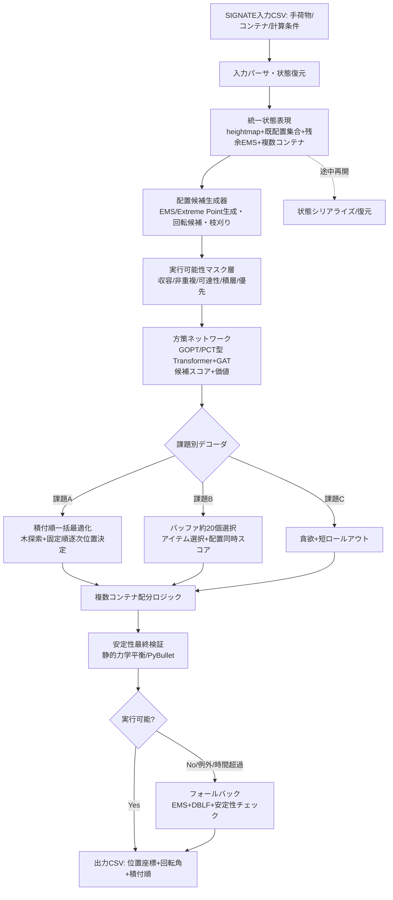

# NEDO懸賞金型コンテスト「コンテスト2：積付アルゴリズム」初期開発アルゴリズム案（詳細設計書）

## TL;DR
- 推奨アーキテクチャは「**EMS候補生成 → GOPT/PCT型 Transformer+GAT スコアリング → 静的力学平衡ベース安定性マスク＋可達性マスク → 課題別デコード（A:木探索, B:バッファ選択, C:貪欲）**」の単一汎用コアで、課題A/B/Cおよび複数コンテナ・途中再開を同一モデルで扱う。
- 状態表現を「heightmap＋既配置集合＋残余EMS（bin寸法非依存の[0,1]正規化6次元記述子）」に統一し、GOPTの汎化能力（Bin-10訓練の方策を再学習なしでBin-30/50/100へ転移し利用率76.0〜76.3%を維持）とPCT/ToP（Tree of Packing）の連続解空間・木探索プランナー化を継承する。
- 非直方体LD3内寸はデータ駆動のパラメトリック多面体表現とし、可達性（前面開口からの直線搬入スイープ体積＋余裕幅）と安定性（支持率→重心投影→静的力学平衡→PyBullet）を階層マスク化。学習方策不調時は純ヒューリスティック（EMS+DBLF+安定性チェック）へ多層フォールバックし、計算停止禁止・3分/10秒制約・過適合排除に対応する。

## Key Findings（設計判断の根拠）
1. **単一コアで統一可能**：PCTの「Deliberate Planning」論文（arXiv:2504.04421, IJRR 2025）は、事前学習済み単一PCTモデルを再学習なしで各BPP設定に out-of-the-box 適用する統一プランニング枠組み **Tree of Packing (ToP)** を実証済み。論文原文は "For different BPP variations with additional decision variables, such as lookahead, buffering, and offline packing, we propose a unified planning framework enabling out-of-the-box problem solving based on a pre-trained PCT model." と明記し、課題A/B/Cを1モデルで扱う本設計の直接的裏付けとなる。
2. **GOPTの汎化が寸法非依存の鍵**：GOPT（Xiong et al., arXiv:2409.05344, IEEE RA-L 2024）はEMSを[0,1]正規化した6次元記述子で表現し、"we directly transfer our policy, trained solely in Bin-10, to the other three environments without fine-tuning" のとおりBin-10（10³）訓練の方策をBin-30/50/100へ再学習なしで転移して利用率76.0〜76.3%を維持。LD3の内寸個体差・複数コンテナ寸法差に対する頑健性を担保する。
3. **安定性は階層評価が最適**：静的力学平衡（Ramos et al., "A container loading algorithm with static mechanical equilibrium stability constraints," Transportation Research Part B, vol.91(C), pp.565–581, 2016）は精度が高いが低速、幾何ルール（支持率・重心投影）は高速。Zhao et al.(2022, Science China Info Sci 65:112105)のstacking treeは安定性解析をO(N²)→O(N log N)化。オンライン推論は幾何プロキシ、学習報酬・最終検証はPyBullet物理シミュ（RoboBPP流の配置後速度監視、CoPack流ドメインランダム化）を使い分ける。
4. **可達性はスイープ体積の干渉判定に帰着**：TAP-Netのprecedence graph（TB/LAB/RAB）と同型の思想で、配置位置→上方リフト→前面開口の直線搬入経路を余裕幅で膨張したAABBスイープ体積として表し、既配置との干渉をボクセル/セル格子で高速チェックする。
5. **非直方体ULDはmoving extreme point＋セル分割**：Heßler, Hintsch & Wienkamp (arXiv:2410.01445)は非直方体ULD対応のためextreme pointを移動させ、ULD空間を小セルに分割して衝突・非浮遊・積載可否チェックを高速化する手法を提示。LD3下部欠き込みへの直接適用が可能。

## Details（設計本体）

### 1. 全体アーキテクチャ



**モジュール分離の原則**：
- **共通コア（課題非依存）**：状態表現、EMS生成、マスク層、スコアリングネットワーク、安定性評価器、複数コンテナ配分、シリアライズ。
- **課題別デコーダ（薄い層）**：A/B/Cで探索戦略のみ差し替え。コアのモデル重みは共有。
- データフローは「観測→状態更新→候補生成→マスク→スコア→デコード→配置→評価器フィードバック→状態更新」の逐次ループ。各課題はこのループの「1個あたりの意思決定範囲」（一括順序固定か、選択自由か、単一観測か）が異なるだけ。

### 2. データ構造・状態表現

#### 2.1 非直方体LD3内部空間の表現
LD3型（AKE/AKN）は外寸統一（1534×2007×1626 mm）だが内寸は形式・個体で異なり、AKE内容積は約4.3 m³、AKNは約4.1 m³と差がある。下部に欠き込みのある非直方体断面のため、**全てデータ駆動・パラメトリック**とする（ハードコード禁止要件対応）。

- **表現1：2D heightmap＋下限プロファイル（ハイブリッド）**
  - コンテナ床面をX-Y格子（例：解像度1〜2cm/セル）に離散化。各セル (i,j) に対し `floor_z[i,j]`（欠き込みで持ち上がった床の高さ）と `ceil_z[i,j]`（上方確保空間を除いた有効天井高さ）を保持。
  - 積付状況は `height[i,j]`（現在の積み上げ上端）で表す。有効空間はセルごとに `[floor_z[i,j], ceil_z[i,j]]` の区間集合。
  - 扉前確保空間・上方確保空間は入力データの立体形状から `floor_z / ceil_z / 前面マージン` に反映。
- **表現2：有効空間多面体**
  - 入力の「利用可能空間の立体形状データ」を凸多面体または凸多面体和（union of convex polytopes）としてパースし、収容判定・EMS切断に使う真値ジオメトリとする。
  - heightmapは高速近似、多面体は厳密判定に使う二層構造。

#### 2.2 EMSリスト（生成・分割・統合・更新）
EMS（Empty Maximal Space）は残余空間を「これ以上拡大できない最大の空箱直方体」の集合で表す。maximal-space法（Parreño, Alvarez-Valdés, Tamarit & Oliveira, "A Maximal-Space Algorithm for the Container Loading Problem," INFORMS J. Computing 20(3):412–422, 2008；Ha et al. 2017 OnlineBPH）は残余空間のマージ処理が不要という利点がある。

- **生成**：コンテナ有効空間から、既配置各アイテムのAABBを「障害物」として差し引き、各軸方向に最大拡張した直方体群を列挙。非直方体床は `floor_z` プロファイルで下面を制約（下部欠き込み領域には床が高いEMSを生成）。
- **記述子**：各EMSを `(x1,y1,z1,x2,y2,z2)` の最小・対角頂点で表し、**コンテナ寸法で割って[0,1]正規化**（GOPT準拠、寸法非依存化）。
- **更新（差分法）**：アイテム配置時、新AABBと交差する既存EMSのみを削除し、それらを新AABBの6面で切断して新EMSを再生成。全再生成せず差分更新でO(交差EMS数)に抑える。
- **統合/枝刈り**：他EMSに完全内包されるEMSを除去（maximal性の維持）。最小寸法が残手荷物の最小寸法未満のEMSを除去。候補は「高さ（z1）」でソートし固定長N（初期値80、GOPT準拠）に padding/clip。

#### 2.3 既配置集合・複数コンテナ状態・シリアライズ
- **既配置集合**：各アイテムを `{id, 種類, 優先flag, コンテナidx, FLB座標(x,y,z), 寸法(l,w,h), 回転(rx,ry,rz), 重量}` で保持。
- **複数コンテナ**：コンテナ配列（2〜6台）。各要素が独立のheightmap/EMS/既配置集合を持ち、配分ロジックがどのコンテナに積むか決定。
- **途中再開シリアライズ**：既配置CSV（位置・回転・寸法・種類）＋残手荷物CSVから状態を完全復元。復元手順＝(1)各コンテナ形状パラメータ読込→(2)既配置アイテムをheightmapへ焼き込み→(3)EMS再生成→(4)残手荷物キュー構築。「複数台に分散して積付開始し未完コンテナのみ再計算」に対応。

### 3. 配置候補生成器

- **EMS/Extreme Point生成**：基本はEMS。非直方体対応として Extreme Point（Crainic, Perboli & Tadei 2008, INFORMS J. Computing）の**moving extreme point**（arXiv:2410.01445）を併用し、下部欠き込みの斜め/段差境界に候補点を移動生成。ULD空間を小セルに分割して衝突・非浮遊・積載可否チェックを高速化。
- **回転候補**：軸整列姿勢を基本とし、通常は水平面内90°回転の2姿勢（GOPT準拠 `[[l,w,h],[w,l,h]]`）。ハード箱で許容される場合のみ最大6姿勢に拡張（変形ソフトは姿勢制限）。手荷物種類（ハード/変形ハード/ソフト変形なし/ソフト変形有り）ごとに許容姿勢集合をパラメータ化。
- **候補数制御・枝刈り**：EMS×姿勢のペアで行動空間 |A|=2N（N=EMS数）。Nを固定長80に制限し行動空間をbin寸法非依存化。実行可能性マスクで無効ペアを事前除去。

### 4. 実行可能性マスク

配置候補(EMS e, 姿勢 o)に対し、以下を順に判定しマスク（0/1）を生成。GOPTと同じくスコアマップにelement-wise積で無効行動を除去。

- **(a) 収容判定**：配置後AABBが有効空間多面体に内包され、`ceil_z` を超えない。非直方体床では底面が `floor_z` プロファイルに支持されるか確認。
- **(b) 非重複判定**：既配置AABB集合との交差なし（heightmap高さ比較＋セル格子で高速化）。
- **(c) ロボット可達性判定**（本コンテスト核心）：
  1. 配置目標位置から鉛直上方に**リフト高さ H_lift（例10cm、課題パラメータ）**持ち上げた中間位置を計算。
  2. 中間位置から前面開口（扉面）まで**水平直線搬入**する軌跡を、手荷物AABBを掃引した**スイープ体積**として構築。
  3. スイープ体積を上下・左右に**余裕幅 δ（例各2cm、課題パラメータ）**膨張。
  4. 膨張スイープ体積と既配置ボクセル/AABBの干渉をチェック。干渉あれば不可達（マスク0）。
  - リフト高さ・余裕幅・開口面の向きは**課題パラメータとして外部化**（SIGNATE入力から読取り）。
- **(d) 積層制約（ソフト上ハード禁止）**：配置対象がハード/変形ハードで、直下の支持アイテムにソフトが含まれる場合は**強マスク（禁止）またはソフト制約（大ペナルティ）**を切替。「極力配置しない」要件のため、既定はソフト制約（違反時ペナルティ）とし、充填率が犠牲になりすぎる場合のみ許容。Junqueira, Morabito & Yamashita (2012, C&OR 39(1):74–85) のload-bearing/fragility定式化を報酬項に反映。
- **(e) 優先手荷物制約**：優先手荷物（ファーストクラス・乗継便）の上に一般手荷物を置く候補にペナルティ。優先手荷物は上側・取出し可能な位置を優先するスコア加点。

**強マスク vs ソフト制約の使い分け**：物理的に不可能な制約（収容・非重複・可達性）は強マスク。品質劣化に留まる制約（積層・優先）はソフト制約（報酬ペナルティ）とし、充填率とのトレードオフを学習で獲得。

### 5. 安定性評価器（階層構成）

Constrained DRL（Zhao et al. AAAI 2021, arXiv:2006.14978）のfeasibility predictor（prediction-and-projection scheme）思想に倣い、計算コスト別に4層。

- **①支持面積率**：配置底面のうち直下で支持されている面積比 `support_ratio`。閾値（例0.6〜0.8、動的安定性考慮で引き上げ）未満は不安定。最速、全候補に適用。
- **②重心投影・支持多角形**：アイテム重心のX-Y投影が支持点群の凸包（支持多角形）内にあるか。arXiv:2507.09123の支持多角形＋重心不確実性を採用し、余裕（重心から多角形境界までの最短距離）を安全余裕係数として算出。
- **③静的力学平衡（力・モーメント平衡）**：Ramos et al. (2016, Transportation Research Part B 91:565–581)の剛体静的平衡。各接触点の法線力・摩擦力について力・モーメント平衡方程式を解き、全接触力が非負（引張なし）かつ摩擦錐内に収まるか線形計画で判定。積み重ねたスタック全体の連鎖的影響を評価。
- **④PyBullet物理検証**：最終候補・学習報酬用。配置後に微小外乱（振動）を与え、200ステップ程度の線速度・角速度（RoboBPP arXiv:2512.04415流）で荷崩れを定量化。CoPack（arXiv:2511.19932）流に摩擦・重心分布をドメインランダム化。同論文は物理シミュ＋実データ微調整で崩壊率を最先端比35%削減と報告。

**使い分け**：
- オンライン推論（10秒制約）：①②のみ（各候補ミリ秒オーダー）。
- 学習報酬・エピソード終端検証：③（数十〜数百ms）。
- 最終セルフ評価・アブレーション：④（秒オーダー、GPU並列）。

**動的安定性プロキシ設計**（評価器が振動含む動的シミュのため）：
- 安全余裕係数（重心-支持多角形境界距離）を報酬に加点。
- 重心高さペナルティ（低重心配置＝重い荷物を下に誘導）。
- 支持率閾値を静的値より引き上げ（動的余裕確保）。
- 遠→近配置を促す side-reward（Zhao et al. 2022, arXiv:2108.13680）で、前面開口から遠い位置を先に埋め可達性と安定性を両立。

### 6. スコアリング／方策ネットワーク（GOPT/PCT型）

GOPTのPacking Transformerを基幹とし、PCTのGAT木符号化を課題A木探索で併用する。

**入力特徴量**：
- **EMS候補**：各EMSを6次元 `(x1,y1,z1,x2,y2,H)`（FLB頂点＋対角頂点）、コンテナ最大寸法の逆数 `factor=1/max(size)` で[0,1]正規化。固定長N=80（GOPT実験値）。
- **手荷物特徴**：2×3行列 `[[l,w,h],[w,l,h]]`（0°/90°姿勢）＝Item Representation(IR)。加えて種類one-hot・優先flag・正規化重量を連結。
- **heightmapエンコード**：Placement GeneratorでEMS計算に使用（Transformerには直接投入せず、EMS記述子に集約）。
- **コンテナパラメータ**：正規化係数・有効容積・扉方向を大域特徴として付加。

**ネットワーク構造**（GOPT準拠、実装値確認済み）：
- EMS・itemをそれぞれ2層MLP+LeakyReLUで**埋め込み次元128**に射影。
- **Packing Transformerブロックを3個スタック**。各ブロック＝self-attention 2層（EMS間・item次元間の関係）＋bi-directional cross-attention 1層（EMS→item, item→EMS）＋2層MLP（{128,128}）×4。各層後にResidual＋LayerNorm。
- **Actor**：EMS特徴とitem特徴をMLP処理後に内積（pointer/score-map方式）→action mask element-wise積→softmax。行動空間 |A|=2N（寸法非依存）。
- **Critic**：item・EMS特徴を次元方向sum→concat（256次元）→3層MLP（128,128,1）でstate value。
- 重み初期化：orthogonal。（注：attention head数は論文本文に明示なくコードのデフォルト値=6を参考値とする）

**汎化のための正規化・相対座標**：全座標をコンテナ寸法で正規化、相対座標表現でbin寸法・課題分布に非依存化。これによりLD3個体差・複数コンテナ寸法差・秘匿課題分布への転移を狙う。

### 7. 課題別デコーダ

#### 課題A（オフライン一括＋逐次再計算）
**積付順一括最適化（最大3分）＋固定順序下の逐次位置決定（1個10秒）**

3分予算配分：順序探索に~150秒、初期位置プランに~20秒、余裕・検証に~10秒。

```
function DECODE_A(items[40..80], containers, budget=180s):
    # フェーズ1: 積付順一括最適化（木探索プランナー）
    precedence = build_precedence_graph(items)      # TAP-Net流TB/LAB/RAB
    root = PCT_state(containers)
    best_order, best_plan = None, -inf
    # Deliberate Planning/ToP型: PCTを木探索プランナー化
    while time_left(budget_phase1):                  # ~150s
        order = beam_search_or_MCTS(root, policy_net, beam_width=W, depth=D)
        # 各ノード展開でGOPTスコアで有望placementに絞る（recursive packing）
        plan = simulate_pack(order, policy_net, stability=static_equilibrium)
        score = fill_rate(plan) + w_stab*stability(plan) + w_reach*reach_margin(plan)
        if score > best_plan: best_order, best_plan = order, plan
    # フェーズ2: 固定順序下で各手荷物の位置を逐次再計算（現場フィードバック対応）
    for item in best_order:                          # 順序は不変
        obs = evaluator_feedback()                    # 最新積付状況
        ems = generate_EMS(obs); mask = feasibility_mask(ems, item)
        pos = argmax(policy_net(ems, item) * mask)    # 1個あたり<10s
        if pos is None: pos = heuristic_DBLF(ems, item, mask)  # フォールバック
        output(item, pos)
```
- Fanslau & Bortfeldt (2010, "A Tree Search Algorithm for Solving the Container Loading Problem," INFORMS J. Computing 22(2):222–235; DOI:10.1287/ijoc.1090.0338) のblock-building＋tree search（CLTRS法、BR1-7で平均充填率約94.5%）を3分予算の高充填参照として、ブロック化した同種手荷物の一括配置を木探索の展開候補に含める。

#### 課題B（バッファ選択型セミオンライン）
**ストック約20個から毎ステップ1個選択＋配置を同時スコアリング**

```
function DECODE_B(buffer[~20], containers):
    while items_remain:
        obs = evaluator_feedback()
        ems = generate_EMS(obs)
        best = -inf; choice = None
        for item in buffer:                           # 全バッファ要素を評価
            mask = feasibility_mask(ems, item)
            score_map = policy_net(ems, item) * mask  # TAP-Net++流 多候補×多アイテム同時attention
            s, pos = max(score_map)
            if s > best: best, choice, best_pos = s, item, pos
        output(choice, best_pos)
        buffer.remove(choice); buffer.add(refill())   # 1個積むと1個補充
```
- arXiv:2208.07123のバッファ付きmodel-based RL（AlphaGo型MCTS）を選択方策のロールアウト評価に採用可。Deliberate Planning/ToP（arXiv:2504.04421）のbuffering統一枠組みで事前学習済みコアをそのまま適用。

#### 課題C（完全オンライン）
**到着順1個ずつ観測・貪欲＋短ロールアウト**

```
function DECODE_C(stream, containers):
    for item in stream:                               # 観測は1個のみ
        obs = evaluator_feedback()
        ems = generate_EMS(obs); mask = feasibility_mask(ems, item)
        # 貪欲: 方策の最大スコア。時間余裕あれば1-2手先の短ロールアウトで検証
        candidates = topk(policy_net(ems, item) * mask, k=3)
        pos = best_by_short_rollout(candidates)       # 期待将来価値で選択
        if pos is None: pos = heuristic_DBLF(ems, item, mask)
        output(item, pos)
```

### 8. 複数コンテナ配分ロジック

指定台数（2〜6台）に対応し、使い分け指示をコスト項/マスクで実装。

- **均等積み**：各コンテナの現充填率の逆数をスコアに乗じ、低充填コンテナを優先。
- **集中積み**：現在アクティブな1台を充填率が閾値に達するまで優先（他台をマスク）。
- **指定充填率到達後に次コンテナ**：`fill_rate >= target` で当該コンテナをマスクし次台をアクティブ化。
- **優先手荷物のコンテナ指定**：優先手荷物は指定コンテナのEMSのみマスク許可。
- スケール：コンテナ配列をループ処理し、各台独立のEMS/heightmap。配分は上位のメタ方策（ルールベース＋スコア補正）で決定し、コアの配置方策は台ごとに共通適用。実運用LD3型6台標準に対応。Junqueira et al. (2012, Annals of OR) のmulti-drop制約定式化を配分順序制約として拡張可能。

### 9. 学習戦略

- **RL環境（自作シミュレータ）**：heightmap＋EMS＋非直方体床の高速シミュレータ。物理検証はPyBullet（Isaac Sim併用可）でバッチ並列。
- **報酬関数**（GOPT基準＋制約項）：
  - ステップ報酬 `r_t = v_i /(有効容積)`（積んだ体積の正規化増分、dense）。GOPTはこのstep-wise報酬でterminal報酬（利用率70.9%）やheuristic報酬（72.4%）を上回り76.1%を達成。
  - 安定性項：`+ w1 * safety_margin - w2 * cg_height`。
  - 可達性余裕項：`+ w3 * reach_clearance`。
  - 制約違反ペナルティ：積層違反・優先違反に負報酬（ソフト制約）。
  - 終端報酬：最終充填率（補助的、重み小）。
  - 重み初期値案：`w1=0.3, w2=0.2, w3=0.2`（アブレーションで調整）。
- **PPOハイパーパラメータ**（GOPT準拠、実験値確認済み）：learning rate 7×10⁻⁵ 線形減衰・Adam、γ=1、GAE λ=0.96、clip ε=0.3、value係数c1=0.5、entropy係数c2=0.001、並列環境128、batch 128、総ステップ4千万（GOPTは約6時間で収束 / NVIDIA RTX 3090 + Core i7-14700K）。
- **ドメインランダム化**：手荷物寸法分布・重量分布・種別比率・内寸ばらつき（AKE/AKN個体差）・リフト高さ/余裕幅・初期状態（空/途中積付）を毎エピソード乱択。CoPack流に摩擦・重心分布も乱択し秘匿課題・実物データへの汎化を確保。
- **カリキュラム学習**：空コンテナ・少数手荷物→途中積付・多数手荷物・複数台へ段階的に難化。
- **模倣学習（ウォームスタート）**：EMS+DBLF＋Fanslau-Bortfeldt木探索のヒューリスティック解で初期方策をpretrainし収束加速。
- **ロバストRL**：Adjustable Robust RL（NeurIPS 2023, arXiv:2310.04323）で敵対的分布に対応し、秘匿課題の最悪ケース性能を底上げ。

### 10. フォールバック設計（多層防御）

計算停止禁止・大幅減点回避のため、例外・時間超過を全て捕捉し純ヒューリスティックへ縮退。

```
function SAFE_DECIDE(item, obs, deadline):
    try:
        with timeout(deadline - margin):
            pos = policy_net_decode(item, obs)        # 第1層: 学習方策
            if pos and feasible(pos): return pos
    except (Timeout, Exception): pass
    pos = heuristic_EMS_DBLF(item, obs)               # 第2層: EMS+DBLF+安定性
    if pos and feasible(pos): return pos
    pos = first_fit_any_feasible(item, obs)           # 第3層: 実行可能な任意位置
    if pos: return pos
    return SKIP_item_safely(item)                     # 第4層: 安全にスキップ（停止しない）
```
- 各層は独立に例外を捕捉。最下層は「積まずに次へ進む」ことで**プログラム停止を絶対回避**。
- 時間監視は各手荷物ごとにデッドライン（10秒-マージン）で打ち切り、確定済み解を返す。

### 11. 汎化・ロバスト化戦略（過適合回避）

- **相対座標・正規化表現**で特定コンテナ寸法への過適合を排除。
- **ドメインランダム化＋ロバストRL**で秘匿課題分布に備える。
- **公開課題スコアからの評価器重み逆推定**：公開リーダーボードのスコア変動から、非公開評価器の充填率/安定性/可達性の相対重みを回帰推定し、報酬重みを較正。ただし逆推定は特定パターン特化＝過適合リスクがあるため、**汎用型（ドメインランダム化重視）を主軸、逆推定較正は微調整に留める**方針とする。
- **特化型と汎用型の使い分け**：公開競技フェーズでは課題別に微調整した特化型を許容するが、評価フェーズ（秘匿課題）・成果審査では汎用型を提出。過適合検出（公開↔秘匿のスコア乖離）をセルフ評価で監視。

### 12. 性能・時間予算見積り

| モジュール | 計算量オーダー | 想定時間 | 装置 |
|---|---|---|---|
| EMS差分更新 | O(交差EMS数) | <10ms | CPU |
| 可達性スイープ判定 | O(候補数×経路セル数) | 候補あたり<1ms | CPU |
| 安定性①② | O(接触点数) | 候補あたり<5ms | CPU |
| 安定性③静的平衡 | O(接触点数)のLP | 数十〜数百ms | CPU |
| 方策ネット推論 | O(N×埋込次元) | <20ms | GPU/CPU |
| 課題C 1手 | 上記合計 | <100ms（10秒制約に余裕） | GPU/CPU |
| 課題B 1手（20候補） | ×20評価 | <500ms | GPU |
| 課題A 順序探索 | ビーム幅×深さ×シミュ | ~150秒（3分制約内） | GPU |
| PyBullet最終検証 | 配置数×200ステップ | 秒オーダー（オフライン） | GPU |

- 想定環境：通常の高性能PC/ワークステーション（GPU 1枚：RTX 3090級、マルチコアCPU）。推論はCPUのみでも10秒制約を満たす設計（GPUは高速化オプション）。

### 13. 検証計画

- **セルフ評価プロトコル**：自作評価器（充填率・幾何安定性）＋PyBullet物理シミュ（動的安定性・荷崩れ）で、公開課題を模した多分布データセットを生成し評価。
- **アブレーション項目**：
  - 安定性プロキシの有無（①②のみ vs ③④併用）。
  - マスクの有無（可達性/積層/優先）。
  - 探索深さ（課題A：ビーム幅・MCTS反復数）。
  - Item Representation・Placement Generator・Packing Transformerの有無（GOPT実績：各々除去で76.1%→73.2%/70.6%/67.1%）。
  - ドメインランダム化の範囲。
- **汎化検証**：訓練分布と異なる寸法分布・種別比率・内寸ばらつきでの性能低下幅を測定。公開↔秘匿の乖離を過適合指標として監視。

### 14. コンテスト要件対応表

| コンテスト要件 | 設計要素 |
|---|---|
| (1) 手荷物情報受取り（外寸・重量・種類・優先） | §2入力パーサ、§6手荷物特徴量（IR＋種類one-hot＋優先flag＋重量） |
| (2) コンテナ形状受取り（非直方体LD3・データ駆動） | §2.1パラメトリック多面体＋heightmap/プロファイル、ハードコード禁止対応 |
| (3) 出力（種類・優先・積付順・位置座標・回転角） | §1出力CSV、§7各デコーダのoutput |
| (4) ハード制約(a)収容・非重複 | §4(a)(b)マスク |
| (4) ハード制約(b)可達性 | §4(c)スイープ体積干渉判定、余裕幅/リフト高さ外部化 |
| (4) ハード制約(c)計算時間3分/10秒 | §12時間予算、§7デコーダのデッドライン管理 |
| (4) ハード制約(d)計算停止禁止 | §10多層フォールバック |
| (4) ハード制約(e)途中再開 | §2.3シリアライズ/復元 |
| (4) ハード制約(f)複数コンテナ・使い分け | §8配分ロジック（均等/集中/充填率/優先） |
| (5) 品質(a)荷崩れ安定性 | §5階層安定性評価、§9動的安定性プロキシ報酬 |
| (5) 品質(b)充填率90%目標 | §6スコアリング、§7課題A木探索、§9充填率報酬 |
| (5) 品質(c)ソフト上ハード禁止 | §4(d)積層制約マスク/ソフト制約 |
| (5) 品質(d)優先手荷物上側 | §4(e)優先制約 |
| (6) 動作環境（高性能PC/WS） | §12 GPU/CPU想定 |
| 追加(1) 処理性能 | §12計算量・時間見積り |
| 追加(2) 信頼性（停止禁止） | §10フォールバック |
| 追加(3) 作業性（可読性・拡張性） | §1モジュール分離、共通コア/薄いデコーダ |
| 追加(4) 拡張性（形状・手荷物追加、再学習サンプル数） | §Recommendations拡張方針、ファインチューニング方針 |

### 15. 主要コンポーネント擬似コード

#### EMS更新（差分法）
```
function UPDATE_EMS(ems_list, placed_aabb, floor_profile, container):
    new_list = []
    for ems in ems_list:
        if not intersect(ems, placed_aabb):
            new_list.append(ems)                      # 交差しないEMSは保持
        else:
            # 交差EMSを新AABBの6面で切断し新EMSを生成
            for face in 6_faces(placed_aabb):
                sub = cut(ems, face)
                if valid(sub, floor_profile): new_list.append(sub)
    new_list = remove_contained(new_list)             # 内包EMS除去（maximal維持）
    new_list = prune_too_small(new_list, min_item_dim)
    new_list = sort_by_z(new_list)[:N]                # 高さソート・固定長N
    return normalize(new_list, container.size)        # [0,1]正規化
```

#### 可達性判定
```
function REACHABLE(pos, item_aabb, obs, H_lift, delta, door_dir):
    lift_pos = pos + (0,0,H_lift)                      # 上方リフト
    sweep = swept_volume(item_aabb, from=lift_pos, to=door_plane(door_dir))
    sweep = inflate(sweep, delta)                      # 余裕幅で膨張
    for other in obs.placed_aabb:
        if intersect(sweep, other): return False       # 搬入経路上に障害物
    if not within_container(sweep, obs.container): return False
    return True
```

#### 安定性判定（階層）
```
function STABLE(pos, item, obs, mode):
    sr = support_ratio(pos, item, obs.height)
    if sr < TH_support: return False                   # ①支持率
    if not cg_in_support_polygon(pos, item, obs): return False  # ②重心投影
    if mode in {TRAIN, FINAL}:
        if not static_equilibrium(pos, item, obs.stack): return False  # ③力学平衡
    if mode == FINAL:
        return pybullet_verify(pos, item, obs, perturb=True, steps=200) # ④物理
    return True
```

#### 課題A/B/Cメインループ（統一）
```
function MAIN(task, input_csv):
    state = restore_state(input_csv)                   # 途中再開対応
    containers = state.containers
    if task == 'A':
        order = plan_order(state.items, budget=150s)   # 一括順序最適化
        queue = fixed(order)
    elif task == 'B':
        queue = buffer_selector(state.buffer)          # 動的選択
    else:  # C
        queue = arrival_stream(state)                  # 到着順
    while not queue.empty():
        item = queue.next(task)                         # A:順序固定, B:選択, C:到着
        obs = evaluator_feedback()
        cid = allocate_container(item, containers, policy=state.alloc_policy)
        pos = SAFE_DECIDE(item, obs[cid], deadline=10s) # フォールバック内包
        apply(pos); output_csv(item, cid, pos)
        UPDATE_EMS(containers[cid].ems, pos.aabb, ...)
    finalize_and_verify(containers)                     # 最終安定性検証
```

## Recommendations（段階的実装計画）

**フェーズ0（基盤・2〜3週）**：非直方体LD3のパラメトリック表現、heightmap/EMS差分更新、収容・非重複・可達性マスク、純ヒューリスティック（EMS+DBLF+支持率安定性）を実装。**まずヒューリスティック単体でSIGNATEに提出可能な状態**を作る（フォールバック層＝最低保証性能）。ベンチマーク：充填率70%台・制約違反0・停止0。

**フェーズ1（学習コア・4〜6週）**：GOPT型Packing Transformer（埋込128・3ブロック・PPO）を自作シミュレータで学習。報酬はstep-wise体積＋安定性/可達性項。ドメインランダム化を初期から導入。ベンチマーク：課題Cで充填率GOPT水準（75%+）、ヒューリスティック超え。

**フェーズ2（課題別デコーダ・3〜4週）**：課題A木探索（Deliberate Planning/ToP型＋Fanslau-Bortfeldtブロック）、課題Bバッファ選択、複数コンテナ配分を実装。ベンチマーク：課題A充填率85%+目標（3分予算）、人手同等90%を上限目標。

**フェーズ3（安定性高度化・汎化・3〜4週）**：静的力学平衡③・PyBullet④検証を報酬とセルフ評価に統合。ロバストRL・カリキュラム学習で秘匿課題対応。ベンチマーク：PyBullet荷崩れ率をCoPack水準（崩壊率35%削減相当）まで低減、公開↔秘匿スコア乖離<5%。

**しきい値によるプラン変更基準**：
- 充填率が目標を5%以上下回る→探索深さ（課題A）・候補数N増加、報酬重み再較正。
- 制約違反/停止が1件でも発生→フォールバック層強化を最優先（性能向上より信頼性）。
- 公開↔秘匿乖離>10%→過適合。ドメインランダム化範囲拡大、特化型を廃し汎用型に統一。
- 10秒/3分超過→安定性③④をオンラインから外し①②のみ、方策推論のバッチ化。

**書面審査対応**：
- **ファインチューニング方針**：実導入時は対象空港の実手荷物分布で数千〜1万エピソードの追加学習（GOPTの汎化性により少量で足りる想定）。
- **再学習サンプル数提案**：コンテナ形状追加は幾何がパラメトリックなので**再学習不要**（データ駆動で即対応）。手荷物種別追加・分布大幅変化時のみ、目安として**1万〜5万エピソード**の追加学習を提案。
- **継続的再計算**：形状・手荷物追加はパラメータ/特徴量拡張のみで対応し、コア構造は不変。

## Caveats（留意点・不確実性）

- **評価器は非公開・物理シミュ含む**：本設計の安定性プロキシ（①②）と評価器の動的シミュとの相関は保証されない。PyBulletセルフ評価で相関を継続検証し、閾値を保守的に設定すべき。評価器の重み逆推定は過適合リスクがあるため補助的較正に限定する。
- **GOPTの76%は10³立方体bin・合成データ（RS dataset）の数値**：LD3非直方体・実手荷物分布で同水準が出る保証はない。人手同等90%は課題A（オフライン一括）で木探索を効かせた場合の目標であり、課題C（完全オンライン）では構造的に下回る見込み。
- **可達性のスイープ体積判定は近似**：実際のロボット搬入は回転・多関節経路を伴う可能性があるが、本設計は「上方リフト＋水平直線搬入」の単純化モデル。事務局仕様の搬入モデルが異なる場合は§4(c)の軌跡生成を差し替える必要がある。
- **一部ネットワーク数値はコードのデフォルト値**：GOPTのattention head数は論文本文に明示がなく、コードのデフォルト（heads=6）を参考値とした。EMS候補数もコードデフォルト100に対し論文実験値80を採用。実装時は検証で最適化を要する。
- **静的力学平衡の計算コスト**：接触点数が多い密な積付ではLP求解が10秒制約を圧迫し得る。オンラインでは①②に限定し、③はオフライン検証中心とする使い分けが前提。
- **課題間の相互干渉**：単一コアの共有重みが課題A/B/Cで最適点を分け合うため、特定課題で専用微調整に劣る可能性。公開競技では課題別微調整版、評価フェーズでは汎用版という二段構えを推奨。
- **Fanslau-Bortfeldtの充填率**：CLTRS法のBR1-7平均約94.5%は直方体コンテナ・全支持前提のオフラインベンチであり、非直方体LD3・逐次再計算制約下では低下する。あくまで課題A上限の目安。